<h1 id="A0" align="center">Климат в комнате</h1>
<h2 id="A0">Содержание</h2>
<ol>
<li><a href="#мои-наблюдения">Мои наблюдения</a></li>
<li><a href="#паяем-датчик-к-raspberry">Паяем датчик к Raspberry</a></li>
<li><a href="#установка-mysql-базы-данных-в-jail-на-сервер-truenas">Установка MySQL базы данных в jail на сервер TrueNAS</a></li>
<li><a href="#настраиваем-клиент-mysql-на-raspberry">Настраиваем клиент mysql на raspberry</a></li>
<li><a href="#установка-сервера-apache-в-jail-на-сервер-truenas">Установка сервера Apache в jail на сервер TrueNAS</a></li>
<li><a href="#установка-интерпретатора-php-в-jail-на-сервер-truenas">Установка интерпретатора PHP в jail на сервер TrueNAS</a></li>
<li><a href="#настроим-два-виртуальных-хоста-site-и-phpmyadmin">Настроим два виртуальных хоста site и phpMyAdmin</a></li>
<li><a href="#настроим-ssh-в-jail-на-сервере-truenas-для-более-удобного-доступа-к-файлам">Настроим SSH в jail на сервере TrueNAS для более удобного доступа к файлам</a></li>
<li><a href="#фильтры-для-приточной-вентиляции">Фильтры для приточной вентиляции</a></li>
<li><a href="#погода-и-календарь-на-waveshare-display-75-inch-e-paper-hat">Погода и календарь на Waveshare display 7.5 inch e-paper HAT</a></li>
<li><a href="#управление-вентилятором-с-помощью-raspberry">Управление вентилятором с помощью Raspberry</a></li>
</ol>
Это самое важное, особенно если есть маленький ребенок.

Мне стало интересно и необходимо знать температуру и влажность в детской комнате, т.к. у ребенка появились шелушки на коже, сильно пересыхал носик под утро и появлялся кашель.

Задача была сделать не просто монитор, полноценный логер. Чтобы можно было сравнить температуру например год назад. Так же необходимо было знать мгновенные показания не заходя в комнату.

Для решения задачи были выбраны уже имеющиеся и лежащие без дела железки:
1. Raspberry Pi Zero W

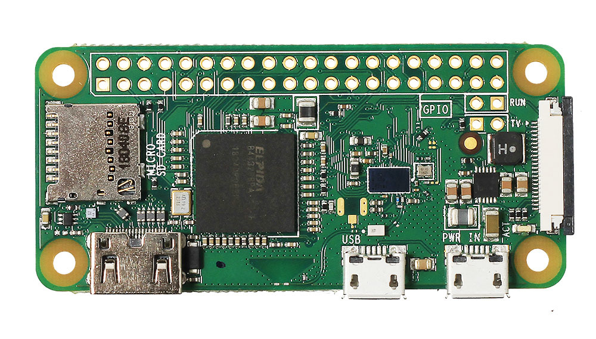

2. Флешка на 4Gb

3. Датчик температуры и влажности

4. В дополнение TrueNAS сервер.

<h2 id="A1" align="center">Мои наблюдения</h2>
1. Если в середине дня нагнать влажность в квартире с 10% до хотя бы 30% то в течении ночи с отключенным увлажнителем она сохраняется при условии падения температуры в течении ночи.

<h2 id="A2" align="center">Паяем датчик к Raspberry</h2>

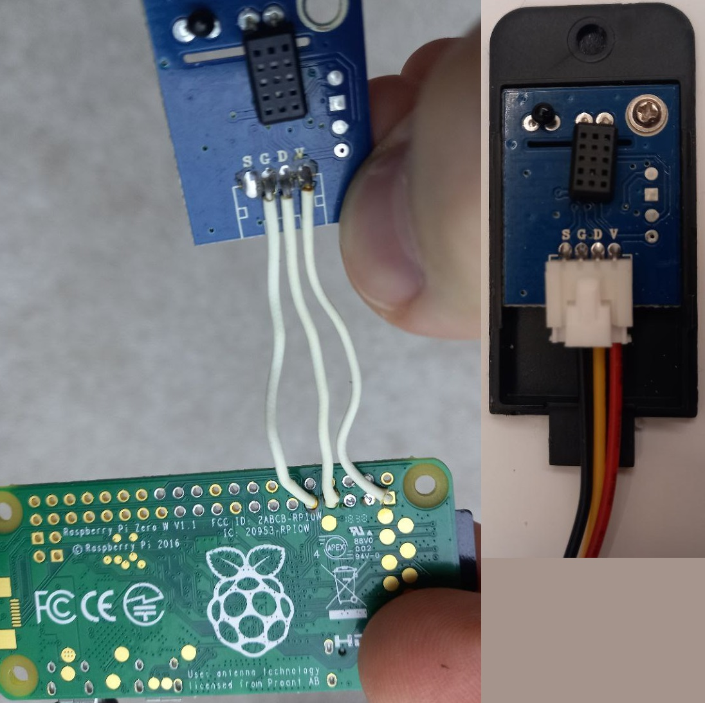

<h2 id="A3" align="center">Установка MySQL базы данных в jail на сервер TrueNAS</h2>
Для этого нас понадобиться Пул на котором будет храниться наша тюрьма.

Т.к. все пулы у меня созданы на засыпающих дисках, то я сделаю отдельный пул на отдельно дополнительном диске, чтобы остальным эта тюрьма не мешала засыпать.

Подключаем диск, включаем NAS и проверяем настройки подключенного диска:

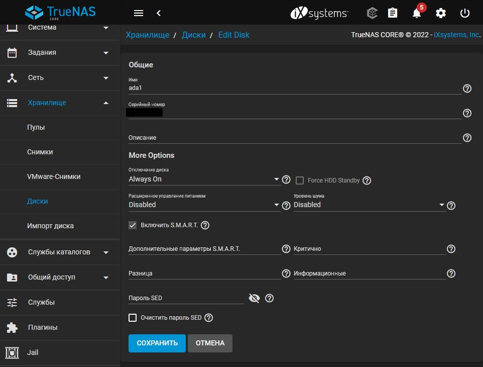

Степень сжатия я оставил LZ4, но наврядли это поможет оптимально сжимать БД. Наверное в будущем стоит поставить значение none, чтобы немного увеличить производительность. Этот размер записи соответствует размеру [стандартной страницы](https://mariadb.com/kb/en/innodb-system-variables/#innodb_page_size), используемой движком InnoDB базы данных MariaDB.

Размер блока я поменял на 16K т.к. это хорошо отразиться на производительности БД MySQL, установленной на этот пул.

[Вот неплохой гайд по настройке рабочей нагрузки](https://openzfs.github.io/openzfs-docs/Performance%20and%20Tuning/Workload%20Tuning.html#mysql).

Создаем пул, заходим в jail и выбираем его для хранения тюрьм. Создаем новую тюрьму:
+ Имя - я назвал MySQL
+ Выпуск - выбрал 13.1-RELEASE-p4
+ Интерфейс IPv4 - Выбрал свой единственный интерфейс re0
+ Адрес IPv4 - указал 192.168.88.251 не входящий в диапазон DHCP сервера моего роутера (100-200)
+ Ставим галочку Автоматический старт и нажимаем Создать.

Далее система скачает образ, установит его и все это время будет висеть окошко "Обождите.." А это примерно минут 15 у меня заняло.

Подключимся к нашему TrueNAS по ssh и введем команду ***jls***, чтобы просмотреть доступные тюрьмы:

    root@freenas:~ # jls
    JID  IP Address      Hostname                    Path
    1  192.168.88.251  MySQL                         /mnt/Share/iocage/jails/MySQL/root

Видим, что тюрьма установилась и запущена. После этого стоит пробежаться по всем созданным вложенным датасетам и проверить настройки для производительности.

Переключимся на консоль нашей тюрьмы указав ее номер ***jexec <номер(JID)> tcsh***:

    root@freenas:~ # jexec 1 tcsh
    root@MySQL:/ #

Обратимся к [руководству](https://www.ricalo.com/blog/mariadb-server-freenas/#) по установке MariaDB на TrueNAS.

Выполним ***pkg update***, потому что вероятно этот менеджер пакетов не установлен:

    pkg update

Посмотрим доступные пакеты MariaDB :

    root@MySQL:~ # pkg search mariadb
    mariadb-connector-c-3.3.2      MariaDB database connector for C
    mariadb-connector-odbc-3.1.15  MariaDB database connector for odbc
    mariadb103-client-10.3.36      Multithreaded SQL database (client)
    mariadb103-server-10.3.36      Multithreaded SQL database (server)
    mariadb104-client-10.4.26      Multithreaded SQL database (client)
    mariadb104-server-10.4.26      Multithreaded SQL database (server)
    mariadb105-client-10.5.17      Multithreaded SQL database (client)
    mariadb105-server-10.5.17      Multithreaded SQL database (server)
    mariadb106-client-10.6.10      Multithreaded SQL database (client)
    mariadb106-server-10.6.10      Multithreaded SQL database (server)

Выполним установку MariaDB :

    pkg install --yes mariadb106-server-10.6.10

Создадим папки в джейле, куда будем монтировать наборы данных. Назначим mysql пользователя как владельца:

    mkdir -p /var/db/mysql/innodb_data
    mkdir -p /var/db/mysql/innodb_log
    mkdir -p /var/db/mysql/datadir

    chown -R mysql:mysql /var/db/mysql/innodb_data
    chown -R mysql:mysql /var/db/mysql/innodb_log
    chown -R mysql:mysql /var/db/mysql/datadir

Закроем сеанс в тюрьме, чтобы мы могли смонтировать наборы данных с нашего FreeNAS:

    exit

Остановим тюрьму:

    iocage stop MySQL

Создадим наборы данных innodb_data, innodb_log и datadir в Share/iocage для монтирования:

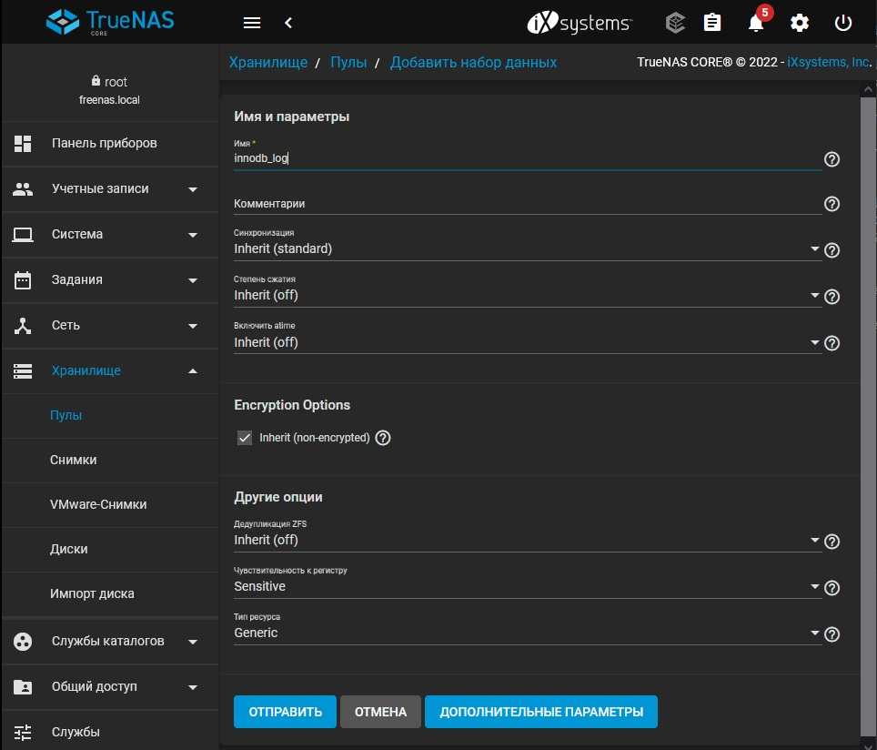

Добавим точки монтирования для innodb_data, innodb_log и datadir:

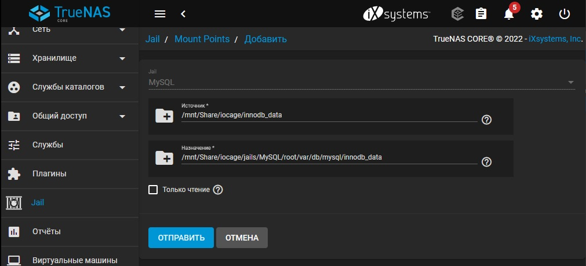

Запустим тюрьму:

    iocage start MySQL

Снова зайдем в ее консоль используя еще одну команду:

    iocage console MySQL

Нам понадобиться nano, поэтому установим его:

    pkg nano

Создадим или изменим файл /usr/local/etc/mysql/my.cnf

    nano /usr/local/etc/mysql/my.cnf

И добавим в него:

    [mysqld]
    # Uncomment the following line to enable access from remote hosts.
    # bind-address    = 0.0.0.0
    innodb_data_home_dir      = /var/db/mysql/innodb_data
    innodb_log_group_home_dir = /var/db/mysql/innodb_log
    datadir                   = /var/db/mysql/datadir
    skip-innodb_doublewrite

Настроим автозапуск службы и запустим службу:

    sysrc mysql_enable=yes
    service mysql-server start

Выполним первоначальную настройку выполнив:

    mysql_secure_installation

Далее следуем инструкциям:

    NOTE: RUNNING ALL PARTS OF THIS SCRIPT IS RECOMMENDED FOR ALL MariaDB
    SERVERS IN PRODUCTION USE!  PLEASE READ EACH STEP CAREFULLY!

    ПРИМЕЧАНИЕ: РЕКОМЕНДУЕТСЯ ЗАПУСКАТЬ ВСЕ ЧАСТИ ЭТОГО СКРИПТА ДЛЯ ВСЕХ MariaDB
    СЕРВЕРОВ В ПРОИЗВОДСТВЕННОМ ИСПОЛЬЗОВАНИИ! ПОЖАЛУЙСТА, ВНИМАТЕЛЬНО ПРОЧИТАЙТЕ КАЖДЫЙ ШАГ!

    In order to log into MariaDB to secure it, we'll need the current
    password for the root user. If you've just installed MariaDB, and
    haven't set the root password yet, you should just press enter here.

    Чтобы войти в MariaDB и обезопасить его, нам понадобится текущий
    пароль для пользователя root. Если вы только что установили MariaDB и
    еще не установили пароль root, вам следует просто нажать enter здесь.

    Enter current password for root (enter for none):
    OK, successfully used password, moving on...

    Введите текущий пароль для root (enter если без пароля):
    ОК, успешно использованный пароль, двигаемся дальше...

    Setting the root password or using the unix_socket ensures that nobody
    can log into the MariaDB root user without the proper authorisation.

    Установка пароля root или использование unix_socket гарантирует, что никто
    не сможет войти в систему пользователя MariaDB root без надлежащей авторизации.

    You already have your root account protected, so you can safely answer 'n'.

    Ваша учетная запись root уже защищена, поэтому вы можете смело отвечать "n".

Переключаемся на аутентификацию:

    Switch to unix_socket authentication [Y/n] y
    Enabled successfully!
    Reloading privilege tables..
    ... Success!

    Change the root password? [Y/n] y
    New password:
    Re-enter new password:
    Password updated successfully!
    Reloading privilege tables..
    ... Success!

    By default, a MariaDB installation has an anonymous user, allowing anyone
    to log into MariaDB without having to have a user account created for
    them.  This is intended only for testing, and to make the installation
    go a bit smoother.  You should remove them before moving into a
    production environment.

    По умолчанию установка MariaDB имеет анонимного пользователя, что позволяет любому пользователю
    входить в MariaDB без необходимости создавать для
    него учетную запись пользователя. Это предназначено только для тестирования и для того, 
    чтобы сделать установку немного более плавной. Вы должны удалить их перед переходом в
    производственную среду.

    Remove anonymous users? [Y/n] y
    ... Success!

    Normally, root should only be allowed to connect from 'localhost'.  This
    ensures that someone cannot guess at the root password from the network.

    Обычно root должно быть разрешено подключаться только с 'localhost'. Этот
    гарантирует, что кто-то не сможет угадать пароль root из сети.

    Запретить удаленный вход в систему с правами суперпользователя?
    Disallow root login remotely? [Y/n] n
    ... Success!

    Remove test database and access to it? [Y/n] y
    Dropping test database...
    ... Success!

    Reloading the privilege tables will ensure that all changes made so far
    will take effect immediately.

    Перезагрузка таблиц привилегий гарантирует, что все внесенные до сих пор изменения
    вступят в силу немедленно.

    Removing privileges on test database...
    ... Success!

### Протестируем установку
    mysql --user=root --password

Увидим следующий вывод:

    Enter password:
    Welcome to the MariaDB monitor.  Commands end with ; or \g.
    Your MariaDB connection id is 23
    Server version: 10.6.10-MariaDB FreeBSD Ports

    Copyright (c) 2000, 2018, Oracle, MariaDB Corporation Ab and others.

    Type 'help;' or '\h' for help. Type '\c' to clear the current input statement.

В приглашении MariaDB вы можете перечислить существующие базы данных:

    root@localhost [(none)]> show databases;

Увидим что-то вроде этого:

    root@localhost [(none)]> show databases;
    +--------------------+
    | Database           |
    +--------------------+
    | datadir            |
    | information_schema |
    | innodb_data        |
    | innodb_log         |
    | mysql              |
    | performance_schema |
    +--------------------+
    6 rows in set (0.002 sec)

Вход с помощью пользователя root в последних версиях заблокирован, поэтому:

    root@localhost [(none)]> CREATE database climatic_db;
    Query OK, 1 rows affected (0.011 sec)

    root@localhost [(none)]> CREATE USER 'my_db_admin'@'localhost' IDENTIFIED BY 'password';
    Query OK, 0 rows affected (0.018 sec)

    root@localhost [(none)]> GRANT ALL PRIVILEGES ON climatic_db.* TO 'my_db_admin'@'localhost';
    Query OK, 0 rows affected (0.013 sec)

    root@localhost [(none)]> CREATE USER 'my_db_admin'@'%' IDENTIFIED BY 'password';
    Query OK, 0 rows affected (0.016 sec)

    root@localhost [(none)]> GRANT ALL PRIVILEGES ON climatic_db.* TO 'my_db_admin'@'%';
    Query OK, 0 rows affected (0.022 sec)

## Проверяем доступ к БД, подключаемся и настраиваем:

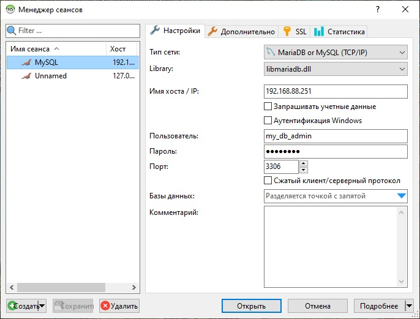

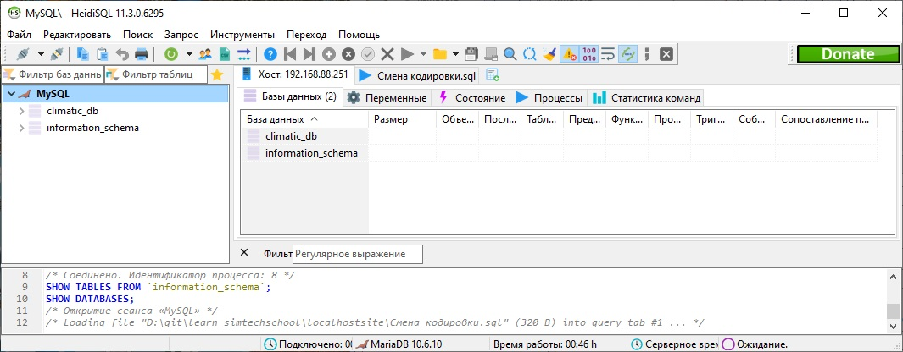

Добавим новую таблицу sensor_data в нашу бд:

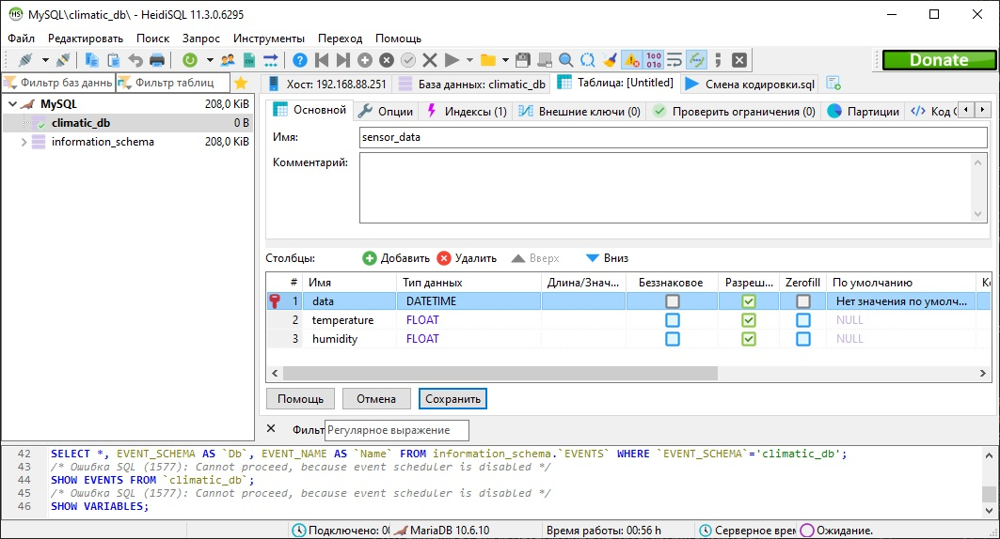

Импортируем старые данные, записанные в формате csv:

    Data;Temperature;Humidity
    2021-11-29 23:33:18;25,6;49,8
    2021-11-29 23:33:40;25,6;49,8
    2021-11-29 23:33:45;25,6;49,8

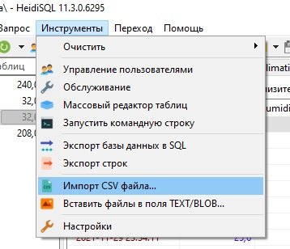

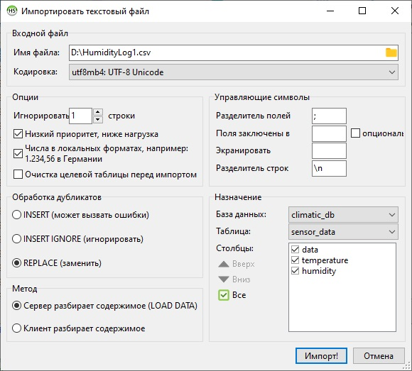

<h2 id="A4" align="center">Настраиваем клиент mysql на raspberry</h2>
Обновим список пакетов:

    sudo apt-get update

Посмотрим доступные клиенты:

    apt-cache search mariadb-client-core

    mariadb-client-core-10.0 - MariaDB database core client binaries
    mariadb-client-core-10.3 - MariaDB database core client binaries
    mariadb-client-core-10.5 - MariaDB database core client binaries

Установим последнюю версию:

    sudo apt-get install mariadb-client-core-10.5

Проверим доступность нашей базы:

    mysql -u my_db_admin -p -h 192.168.88.251

<h2 id="A5" align="center">Установка сервера Apache в jail на сервер TrueNAS</h2>
Подключаемся по SSH к нашему серверу и заходим в созданный нами выше jail:

    iocage console MySQL

Смотрим доступные версии:

    pkg search apache24

На данны момент вывод такой:

    apache24-2.4.54                Version 2.4.x of Apache web server

Устанавливаем: (в запросе подтвержления вводим Y)

    pkg install apache24

Чтобы включить Apache как службу нужно добавить apache24_enable="YES" в файл /etc/rc.conf.  Для этого используем команду sysrc:

    sysrc apache24_enable="YES"

Стартуем:

    service apache24 start

Проверяем:

    service apache24 status

Вывод:

    apache24 is running as pid 20815.

Далее заходим уже на нашем ПК в браузере по адресу нашей jail и видим:

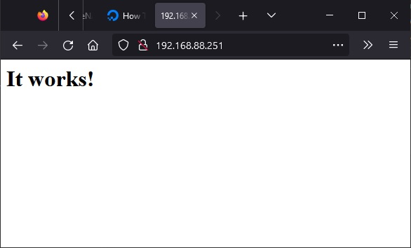

<h2 id="A6" align="center">Установка интерпретатора PHP в jail на сервер TrueNAS</h2>

    pkg search php81
    pkg install php81

Процесс установки:

    Updating FreeBSD repository catalogue...
    FreeBSD repository is up to date.
    All repositories are up to date.
    The following 1 package(s) will be affected (of 0 checked):

    New packages to be INSTALLED:
            php81: 8.1.12

    Number of packages to be installed: 1

    The process will require 27 MiB more space.
    4 MiB to be downloaded.

    Proceed with this action? [y/N]: y
    [MySQL] [1/1] Fetching php81-8.1.12.pkg: 100%    4 MiB   2.3MB/s    00:02
    Checking integrity... done (0 conflicting)
    [MySQL] [1/1] Installing php81-8.1.12...
    [MySQL] [1/1] Extracting php81-8.1.12: 100%

Так же нелюходимо установить модуль для Apache:

    pkg install mod_php81

Процесс установки:

    Updating FreeBSD repository catalogue...
    FreeBSD repository is up to date.
    All repositories are up to date.
    The following 1 package(s) will be affected (of 0 checked):

    New packages to be INSTALLED:
            mod_php81: 8.1.12

    Number of packages to be installed: 1

    The process will require 6 MiB more space.
    2 MiB to be downloaded.

    Proceed with this action? [y/N]: y
    [MySQL] [1/1] Fetching mod_php81-8.1.12.pkg: 100%    2 MiB 870.2kB/s    00:02
    Checking integrity... done (0 conflicting)
    [MySQL] [1/1] Installing mod_php81-8.1.12...
    [MySQL] [1/1] Extracting mod_php81-8.1.12: 100%
    [activating module `php' in /usr/local/etc/apache24/httpd.conf]
    =====
    Message from mod_php81-8.1.12:

    --
    ******************************************************************************

    Make sure index.php is part of your DirectoryIndex.

    You should add the following to your Apache configuration file:

    <FilesMatch "\.php$">
        SetHandler application/x-httpd-php
    </FilesMatch>
    <FilesMatch "\.phps$">
        SetHandler application/x-httpd-php-source
    </FilesMatch>

    ******************************************************************************

    If you are building PHP-based ports in poudriere(8) or Synth with ZTS enabled,
    add WITH_MPM=event to /etc/make.conf to prevent build failures.

    ******************************************************************************

Добавляем строчки в конфиг которые он нас просит. Для этого создадим новый конфиг:

    nano /usr/local/etc/apache24/Includes/php.conf

И добавим туда следующее:

    <IfModule dir_module>
             DirectoryIndex index.php index.html

             <FilesMatch "\.php$">
                      SetHandler application/x-httpd-php
             </FilesMatch>

             <FilesMatch "\.phps$">
                      SetHandler application/x-httpd-php-source
             </FilesMatch>
    </IfModule>

Проверим - что у нас установилось:

    php -v

    PHP 8.1.12 (cli) (built: Nov 17 2022 06:24:56) (NTS)
    Copyright (c) The PHP Group
    Zend Engine v4.1.12, Copyright (c) Zend Technologies

Установим дополнения:

    pkg install php81-extensions

Процесс установки:

    Updating FreeBSD repository catalogue...
    FreeBSD repository is up to date.
    All repositories are up to date.
    The following 17 package(s) will be affected (of 0 checked):
    
    New packages to be INSTALLED:
            php81-ctype: 8.1.12
            php81-dom: 8.1.12
            php81-extensions: 1.1
            php81-filter: 8.1.12
            php81-iconv: 8.1.12
            php81-opcache: 8.1.12
            php81-pdo: 8.1.12
            php81-pdo_sqlite: 8.1.12
            php81-phar: 8.1.12
            php81-posix: 8.1.12
            php81-session: 8.1.12
            php81-simplexml: 8.1.12
            php81-sqlite3: 8.1.12
            php81-tokenizer: 8.1.12
            php81-xml: 8.1.12
            php81-xmlreader: 8.1.12
            php81-xmlwriter: 8.1.12
    
    Number of packages to be installed: 17
    
    The process will require 3 MiB more space.
    767 KiB to be downloaded.
    
    Proceed with this action? [y/N]: y
    [MySQL] [1/17] Fetching php81-simplexml-8.1.12.pkg: 100%   24 KiB  24.1kB/s    00:01
    [MySQL] [2/17] Fetching php81-session-8.1.12.pkg: 100%   37 KiB  37.5kB/s    00:01
    [MySQL] [3/17] Fetching php81-sqlite3-8.1.12.pkg: 100%   22 KiB  23.0kB/s    00:01
    [MySQL] [4/17] Fetching php81-iconv-8.1.12.pkg: 100%   18 KiB  18.7kB/s    00:01
    [MySQL] [5/17] Fetching php81-posix-8.1.12.pkg: 100%   13 KiB  13.5kB/s    00:01
    [MySQL] [6/17] Fetching php81-xmlreader-8.1.12.pkg: 100%   14 KiB  14.8kB/s    00:01
    [MySQL] [7/17] Fetching php81-pdo_sqlite-8.1.12.pkg: 100%   14 KiB  14.0kB/s    00:01
    [MySQL] [8/17] Fetching php81-phar-8.1.12.pkg: 100%  107 KiB 109.3kB/s    00:01
    [MySQL] [9/17] Fetching php81-filter-8.1.12.pkg: 100%   21 KiB  21.9kB/s    00:01
    [MySQL] [10/17] Fetching php81-dom-8.1.12.pkg: 100%   62 KiB  63.2kB/s    00:01
    [MySQL] [11/17] Fetching php81-opcache-8.1.12.pkg: 100%  331 KiB 338.8kB/s    00:01
    [MySQL] [12/17] Fetching php81-tokenizer-8.1.12.pkg: 100%   13 KiB  12.9kB/s    00:01
    [MySQL] [13/17] Fetching php81-xml-8.1.12.pkg: 100%   21 KiB  21.1kB/s    00:01
    [MySQL] [14/17] Fetching php81-pdo-8.1.12.pkg: 100%   48 KiB  49.6kB/s    00:01
    [MySQL] [15/17] Fetching php81-extensions-1.1.pkg: 100%    1 KiB   1.4kB/s    00:01
    [MySQL] [16/17] Fetching php81-xmlwriter-8.1.12.pkg: 100%   15 KiB  15.2kB/s    00:01
    [MySQL] [17/17] Fetching php81-ctype-8.1.12.pkg: 100%    6 KiB   6.5kB/s    00:01
    Checking integrity... done (0 conflicting)
    [MySQL] [1/17] Installing php81-dom-8.1.12...
    [MySQL] [1/17] Extracting php81-dom-8.1.12: 100%
    [MySQL] [2/17] Installing php81-pdo-8.1.12...
    [MySQL] [2/17] Extracting php81-pdo-8.1.12: 100%
    [MySQL] [3/17] Installing php81-simplexml-8.1.12...
    [MySQL] [3/17] Extracting php81-simplexml-8.1.12: 100%
    [MySQL] [4/17] Installing php81-session-8.1.12...
    [MySQL] [4/17] Extracting php81-session-8.1.12: 100%
    [MySQL] [5/17] Installing php81-sqlite3-8.1.12...
    [MySQL] [5/17] Extracting php81-sqlite3-8.1.12: 100%
    [MySQL] [6/17] Installing php81-iconv-8.1.12...
    [MySQL] [6/17] Extracting php81-iconv-8.1.12: 100%
    [MySQL] [7/17] Installing php81-posix-8.1.12...
    [MySQL] [7/17] Extracting php81-posix-8.1.12: 100%
    [MySQL] [8/17] Installing php81-xmlreader-8.1.12...
    [MySQL] [8/17] Extracting php81-xmlreader-8.1.12: 100%
    [MySQL] [9/17] Installing php81-pdo_sqlite-8.1.12...
    [MySQL] [9/17] Extracting php81-pdo_sqlite-8.1.12: 100%
    [MySQL] [10/17] Installing php81-phar-8.1.12...
    [MySQL] [10/17] Extracting php81-phar-8.1.12: 100%
    [MySQL] [11/17] Installing php81-filter-8.1.12...
    [MySQL] [11/17] Extracting php81-filter-8.1.12: 100%
    [MySQL] [12/17] Installing php81-opcache-8.1.12...
    [MySQL] [12/17] Extracting php81-opcache-8.1.12: 100%
    [MySQL] [13/17] Installing php81-tokenizer-8.1.12...
    [MySQL] [13/17] Extracting php81-tokenizer-8.1.12: 100%
    [MySQL] [14/17] Installing php81-xml-8.1.12...
    [MySQL] [14/17] Extracting php81-xml-8.1.12: 100%
    [MySQL] [15/17] Installing php81-xmlwriter-8.1.12...
    [MySQL] [15/17] Extracting php81-xmlwriter-8.1.12: 100%
    [MySQL] [16/17] Installing php81-ctype-8.1.12...
    [MySQL] [16/17] Extracting php81-ctype-8.1.12: 100%
    [MySQL] [17/17] Installing php81-extensions-1.1...
    [MySQL] [17/17] Extracting php81-extensions-1.1: 100%
    =====
    Message from php81-dom-8.1.12:
    
    --
    This file has been added to automatically load the installed extension:
    /usr/local/etc/php/ext-20-dom.ini
    =====
    Message from php81-pdo-8.1.12:
    
    --
    This file has been added to automatically load the installed extension:
    /usr/local/etc/php/ext-20-pdo.ini
    =====
    Message from php81-simplexml-8.1.12:
    
    --
    This file has been added to automatically load the installed extension:
    /usr/local/etc/php/ext-20-simplexml.ini
    =====
    Message from php81-session-8.1.12:
    
    --
    This file has been added to automatically load the installed extension:
    /usr/local/etc/php/ext-18-session.ini
    =====
    Message from php81-sqlite3-8.1.12:
    
    --
    This file has been added to automatically load the installed extension:
    /usr/local/etc/php/ext-20-sqlite3.ini
    =====
    Message from php81-iconv-8.1.12:
    
    --
    This file has been added to automatically load the installed extension:
    /usr/local/etc/php/ext-20-iconv.ini
    =====
    Message from php81-posix-8.1.12:
    
    --
    This file has been added to automatically load the installed extension:
    /usr/local/etc/php/ext-20-posix.ini
    =====
    Message from php81-xmlreader-8.1.12:
    
    --
    This file has been added to automatically load the installed extension:
    /usr/local/etc/php/ext-30-xmlreader.ini
    =====
    Message from php81-pdo_sqlite-8.1.12:
    
    --
    This file has been added to automatically load the installed extension:
    /usr/local/etc/php/ext-30-pdo_sqlite.ini
    =====
    Message from php81-phar-8.1.12:
    
    --
    This file has been added to automatically load the installed extension:
    /usr/local/etc/php/ext-20-phar.ini
    =====
    Message from php81-filter-8.1.12:
    
    --
    This file has been added to automatically load the installed extension:
    /usr/local/etc/php/ext-20-filter.ini
    =====
    Message from php81-opcache-8.1.12:
    
    --
    This file has been added to automatically load the installed extension:
    /usr/local/etc/php/ext-10-opcache.ini
    =====
    Message from php81-tokenizer-8.1.12:
    
    --
    This file has been added to automatically load the installed extension:
    /usr/local/etc/php/ext-20-tokenizer.ini
    =====
    Message from php81-xml-8.1.12:
    
    --
    This file has been added to automatically load the installed extension:
    /usr/local/etc/php/ext-20-xml.ini
    =====
    Message from php81-xmlwriter-8.1.12:
    
    --
    This file has been added to automatically load the installed extension:
    /usr/local/etc/php/ext-20-xmlwriter.ini
    =====
    Message from php81-ctype-8.1.12:
    
    --
    This file has been added to automatically load the installed extension:
    /usr/local/etc/php/ext-20-ctype.ini

Установим cURL — кроссплатформенная служебная программа командной строки, позволяющая взаимодействовать с множеством различных серверов по множеству различных протоколов с синтаксисом URL:

    pkg search php81-curl
    pkg install php81-curl

Установим Xdebug — средство профилирования и отладки PHP скриптов. XDebug поставляется как расширение для PHP. Работает по протоколу DBGp:

    pkg search php81-xdebug

Отвечает - нет доступных пакетов :( ну ОК.

Установим MySQL — это расширение PHP, которое добавляет в язык полную поддержку баз данных MySQL:

    pkg search php81-mysqli
    pkg install php81-mysqli

Установим SOAP (Simple Object Access Protocol) представляет из себя основанный на XML протокол, предназначенный для обмена структурированной информацией между распределенными приложениями поверх существующих в веб протоколов, например HTTP:

    pkg search php81-soap
    pkg install php81-soap

Установим ZIP:

    pkg search php81-zip
    pkg install php81-zip

Установим GD - это графическая библиотека (Графика для WEB-дизайна). Она позволяет быстро создавать изображения с помощью линий, дуг, текста, выбирать цвет, копировать части из других изображений, выполнять заливку, и сохранять результат в PNG- файл:

    pkg search php81-gd
    pkg install php81-gd

Ну и по-идее все. Можно закинуть index.php по адресу /usr/local/www/ следующего содержания:

    <?php
        phpinfo();
    ?>

И проверить что страничка информации открылась. НО! Всеравно нихрена не работает. Ищем где же у нас установились расширения например так:

    find / -name pdo_sqlite.so

И видим следующее:

    /usr/local/lib/php/20210902/pdo_sqlite.so

Мда.. Ну и название.. Чтож, добавляем путь в php.ini:

    extension_dir = "./usr/local/lib/php/20210902/"

И перезагружаем сервер Apache:

    service apache24 restart

Т.е. в отличие от винды тут не нужно прописывать нужные extension в php.ini все осталось закоментировано.

<h2 id="A7" align="center">Настроим два виртуальных хоста site и phpMyAdmin</h2>
Откроем Midnight Commander от имени администратора:

    root@MySQL:~ # mc

<h2 id="A8" align="center">Настроим SSH в jail на сервере TrueNAS для более удобного доступа к файлам</h2>
Включите сервер ssh. Для этого отредактируйте файл /etc/rc.conf и добавьте строку:

    sysrc sshd_enable="YES"

По умолчанию для root запрещен логин по ssh. Если все-таки хотите это разрешить (помните, что это небезопасно, лучше пользоваться командой su), то отредактируйте файл /etc/ssh/sshd_config, раскомментируйте и измените следующие опции (они должны быть в файле в таком виде, как указано здесь):

     ...
    PermitRootLogin yes
     ...
    PasswordAuthentication yes
     ...

Запустите или Перезапустите sshd (доступны, кроме restart, команды start и stop):

    /etc/rc.d/sshd start
    /etc/rc.d/sshd restart

    или, если демон уже запущен, так:

    # killall -HUP sshd

Так же не лишним будет сбросить пароль root:

    passwd root
    Changing local password for root
    New Password:
    Retype New Password:

<h2 id="A9" align="center">Фильтры для приточной вентиляции</h2>

Для начала немного нормативной информации:

[Источник](https://dustintank.com/klassi_pili_dlya_promishlennih_pilesosov/)

Класс пыли – важная характеристика при выборе индустриальных пылесосов. От нее напрямую зависит класс этих агрегатов, специфика их конструкции и степень очистки, необходимая для безопасного выполнения работ.

### Классы опасности пыли

В нормативных документах и инструкциях показатель опасности обозначается латинскими буквами.

**L** – малоопасные пылевые частицы от гипса, кирпича, мела, извести, слюды. Специальных требований к фильтрам таких уборочных машин не предъявляется, как нет и строгих правил для утилизации собранного мусора.

**М** –обозначает средний класс опасности. Это пыль от бетона, а также та, что образуется в помещениях АЭС и электростанций. Здесь требования к оборудованию гораздо строже – как по качеству фильтра, так и по скорости воздушного потока. Система фильтрации должна задерживать до 99% мелкодисперсных частиц.

**Н** – означает высокую степень опасности. Это ядовитые красители, патогенные микроорганизмы, смолы, формальдегид и другие токсичные вещества. Требования к агрегатам наиболее строгие – обязательны многоуровневая фильтрация, измерение скорости и регулировка воздухопотока. Утилизация отходов производится без пыли.

В отдельную группу выделяют асбест (обозначается буквой «A» или словом Asbest). Сегодня его использование в строительстве полностью запрещено. Однако высокоопасные асбестовые микрочастицы могут присутствовать при ремонте и реновации старых зданий.

| Класс пыли | Опасность при предельно допустимой концентрации | Необходимая фильтрация, %, менее |
| --- | --- | --- |
| L | более 1 мг/м³ | 1 |
| M | 0,1–1 мг/м³ | 0,1 |
| H | менее 0,1 мг/м³ | 0,01 |
| А | более 0,1 мг/м³ | 0,01 |

Далее посетим [Википедию](https://ru.wikipedia.org/wiki/HEPA) Посмотрим на классы HEPA фильров.

И заглянем на [хабр](https://habr.com/ru/companies/tion/articles/385461/), узнаем, что такое HEPA-фильтр: принципы работы и неочевидные факты.

Так же не лишним заглянуть и вот [сюда](https://habr.com/ru/companies/tion/articles/368757/), и подумать какой фильтр нужен.

Так же хочу отметить, для любителей сэкономить. Автомобильные моторные фильтра не подходят для пылесосов и уж темболее для вентиляции т.к. их эфективность ниже 85%. Они пропускают всю мелкую пыль и работают чисто по механическому принципу. Я лично убедился в этом, попробовав заменить в своем пылесосе фильтр на аналогичный автомобильный. В солнечных лучах меняя фильтры можно невооруженным глазом увидеть облако пыли, которое пропускает автомобильный фильтр.

Исходя из всего вышеизложенного я пока остановлюсь на бумажном фильтре для пылесоса класса М [HEPA фильтр MAXX 00_11P_00](https://www.ozon.ru/product/hepa-filtr-maxx-00-11p-00-944891213/?advert=_ZGocWnG7rLAubeZOvLzm17onyOOT35BQaueqVM6Kt1jIefOcc02x6BfAPc8eOTaVZgvg9kbGUs_LCINevw7pii7KvFgKAFxpr7u5up9hPzguym3c71t2R2FQf-CKw0bd_jAkZhepZgZ9OZigOoePu7I0kTaQGAWFs_s9GyUABfRlzVYUvTgzKujJeb5qz7OHIok60tzjx9CJVpQcHb9iw&avtc=1&avte=2&avts=1683051923&sh=qpozlgy9Lg) для пылесоса Bosch GAS 35 M,L,AFC. Погоняю вентиляцию с ним. После года использования я заметил налет на крыльчатке вентилятора, который стоит после мешкового фильтра. Этот слой очень тонкий, но хотелось бы и его не иметь.

<h2 id="A10" align="center">Погода и календарь на Waveshare display 7.5 inch e-paper HAT</h2>

[Mendhak](https://code.mendhak.com/raspberrypi-epaper-dashboard/) [Mendhak-Git](https://github.com/mendhak/waveshare-epaper-display) [ESP8266](https://www.davidgf.net/2016/06/12/wifi_display/)

<h2 id="A11" align="center">Управление вентилятором с помощью Raspberry</h2>

    pi@raspberrypi:~ $ sudo su
    root@raspberrypi:/home/pi# echo "26" > /sys/class/gpio/export
    root@raspberrypi:/home/pi# echo "out" > /sys/class/gpio/gpio26/direction
    root@raspberrypi:/home/pi# echo "1" > /sys/class/gpio/gpio26/value
    root@raspberrypi:/home/pi#

sudo apt-get install python3-jedi
sudo bluetoothctl
agent on
scan on
Копируем адрес нашего устройства
20:13:05:22:01:70 Vent_control
20:13:05:22:01:38 Temp_control
sudo rfcomm bind 7 20:13:05:22:01:38
sudo rfcomm bind 8 20:13:05:22:01:70
Вставим эти команды в /etc/rc.local

# Полезные ссылки

+ [Bluetooth консоль для Raspberry](https://hacks.mozilla.org/2017/02/headless-raspberry-pi-configuration-over-bluetooth/)
+ [Cервер беспроводной консоли Bluetooth на Raspberry Pi Zero W](https://www.historiantech.com/create-a-bluetooth-wireless-console-server-with-raspberry-pi-zero-w/)
