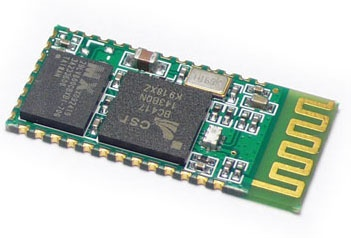

<h1 align="center">Управление вентилятором</h1>
<h2>Содержание</h2>
<ol>
<li><a href="#bluetooth-модуль-hc05">Bluetooth модуль HC05</a></li>
</ol>

<h2 align="center">Bluetooth модуль HC05</h2>

Напряжение питания модуля: 3.3 В

Потребляяемый ток: 50 мА

<a href="supplementary_files/HC-05 Datasheet.pdf">Datasheet</a>

Этот модуль может работать в 3-х режимах:
1. **Master** (или сервер) — в этом режиме модуль может сам подключиться к какому-нибудь Bluetooth девайсу. AT+ROLE=1
2. **Slave** — в этом режиме другой мастер может подключиться к модулю. AT+ROLE=0
3. **Slave-loop** — здесь модуль отправляет обратно все байты, которые ему прислали. AT+ROLE=2

### Конфигурация модуля:

Для того, чтобы настроить BT модуль нужно:
1. Перевести модуль в режим приема AT команд, замкнув PIO11 на +3.3 V
2. Подключиться к UART'у модуля проводами, настроить COM порт вот так:

    Baudrate = 38400
    StopBits = 1
    DataBits = 8
    Parity = none
    Handshaking = none

В терминале настроить отправку символов конца строки CR+LF

И отправить ему команду: **AT**

После каждой успешно выполненной команды модуль отвечает: **OK**

[Деталька](http://we.easyelectronics.ru/part/rabota-s-bluetooth-modulem-hc05.html)

# Полезные ссылки

+ [Таймер ШИМ HAL.](https://narodstream.ru/stm-urok-10-hal-izuchaem-pwm-shim-migaem-svetodiodami-plavno/)
+ [HAL Таймер в режиме захвата. Енкодер.](https://istarik.ru/blog/stm32/121.html)
+ [Подключаем bluetooth-модуль HC-05](https://narodstream.ru/stm-urok-97-podklyuchaem-bluetooth-modul-hc-05/)

38 кГц  35% скважность 72Мгц PSC=0x0766 CCR=0x5999

21имп преамбула=167

17_low_cool  = 4D B2 F9 06 00 FF
18_low_cool  = 4D B2 F9 06 08 F7
19_low_cool  = 4D B2 F9 06 0C F3
20_low_cool  = 4D B2 F9 06 04 FB
21_low_cool  = 4D B2 F9 06 06 F9
22_low_cool  = 4D B2 F9 06 0E F1
23_low_cool  = 4D B2 F9 06 0A F5
24_low_cool  = 4D B2 F9 06 02 FD
25_low_cool  = 4D B2 F9 06 03 FC
26_low_cool  = 4D B2 F9 06 0B F4
27_low_cool  = 4D B2 F9 06 09 F6
28_low_cool  = 4D B2 F9 06 01 FE
29_low_cool  = 4D B2 F9 06 05 FA
30_low_cool  = 4D B2 F9 06 0D F2

17_auto      = 4d b2 f8 07 10 ef
18_auto      = 4d b2 f8 07 18 e7
19_auto      = 4d b2 f8 07 1c e3
20_auto      = 4d b2 f8 07 14 eb
21_auto      = 4d b2 f8 07 16 e9
22_auto      = 4d b2 f8 07 1e e1
23_auto      = 4d b2 f8 07 1a e5
24_auto      = 4d b2 f8 07 12 ed
25_auto      = 4d b2 f8 07 13 ec
26_auto      = 4d b2 f8 07 1b e4
27_auto      = 4d b2 f8 07 19 e6
28_auto      = 4d b2 f8 07 11 ee
29_auto      = 4d b2 f8 07 15 ea
30_auto      = 4d b2 f8 07 1d e2

17_low_auto  = 4D B2 F8 07 10 EF
17_low_fan   = 4D B2 F9 06 27 D8
17_low_heat  = 4D B2 F9 06 30 CF
17_low_dry   = 4D B2 F8 07 20 DF
17_auto_cool = 4D B2 FD 02 00 FF
17_high_cool = 4D B2 FC 03 00 FF
17_med_cool  = 4D B2 FA 05 00 FF

off          = 4D B2 DE 21 07 F8
sleepOn      = 4D B2 07 F8 C0 3F
sleepOff     = 4D B2 FD 02 0B F4
swing        = 4D B2 D6 29 07 F8
direct       = 4D B2 F0 0F 07 F8
shortCut     = 4D B2 F8 07 1B E4
clean        = AD 52 AF 50 55 AA
ledDisplay   = AD 52 AF 50 A5 5A
turbo        = AD 52 AF 50 45 BA