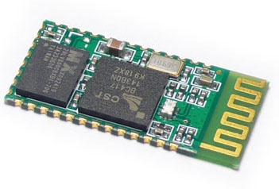

<h1 align="center">Управление вентилятором</h1>
<h2>Содержание</h2>
<ol>
<li><a href="#bluetooth-модуль-hc05">Bluetooth модуль HC05</a></li>
</ol>

<h2 align="center">Bluetooth модуль HC05</h2>

Напряжение питания модуля: 3.3 В

Потребляяемый ток: 50 мА

<a href="supplementary_files/HC-05 Datasheet.pdf">Datasheet</a>

Этот модуль может работать в 3-х режимах:
1. **Master** (или сервер) — в этом режиме модуль может сам подключиться к какому-нибудь Bluetooth девайсу. AT+ROLE=1
2. **Slave** — в этом режиме другой мастер может подключиться к модулю. AT+ROLE=0
3. **Slave-loop** — здесь модуль отправляет обратно все байты, которые ему прислали. AT+ROLE=2

### Конфигурация модуля:

Для того, чтобы настроить BT модуль нужно:
1. Перевести модуль в режим приема AT команд, замкнув PIO11 на +3.3 V
2. Подключиться к UART'у модуля проводами, настроить COM порт вот так:

    Baudrate = 38400
    StopBits = 1
    DataBits = 8
    Parity = none
    Handshaking = none

В терминале настроить отправку символов конца строки CR+LF

И отправить ему команду: **AT**

После каждой успешно выполненной команды модуль отвечает: **OK**

[Деталька](http://we.easyelectronics.ru/part/rabota-s-bluetooth-modulem-hc05.html)

# Полезные ссылки

+ [Таймер ШИМ HAL.](https://narodstream.ru/stm-urok-10-hal-izuchaem-pwm-shim-migaem-svetodiodami-plavno/)
+ [HAL Таймер в режиме захвата. Енкодер.](https://istarik.ru/blog/stm32/121.html)
+ [Подключаем bluetooth-модуль HC-05](https://narodstream.ru/stm-urok-97-podklyuchaem-bluetooth-modul-hc-05/)